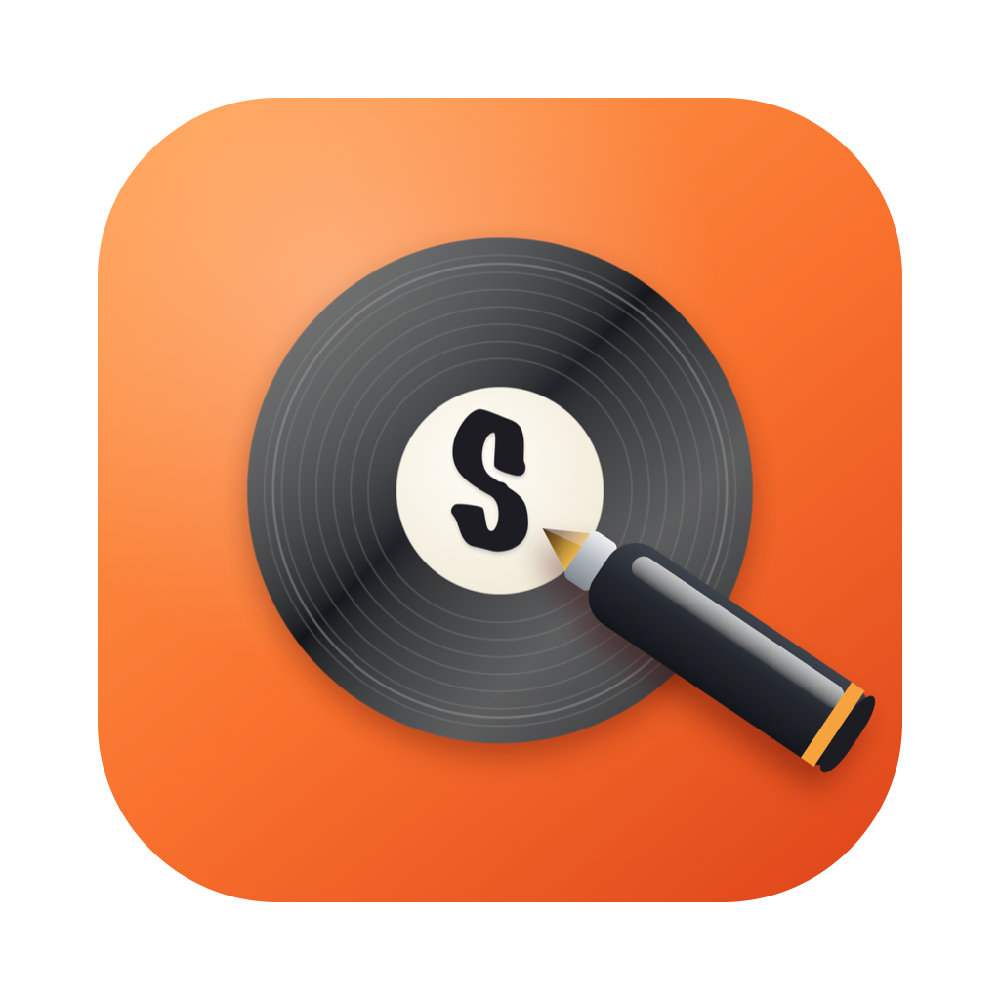
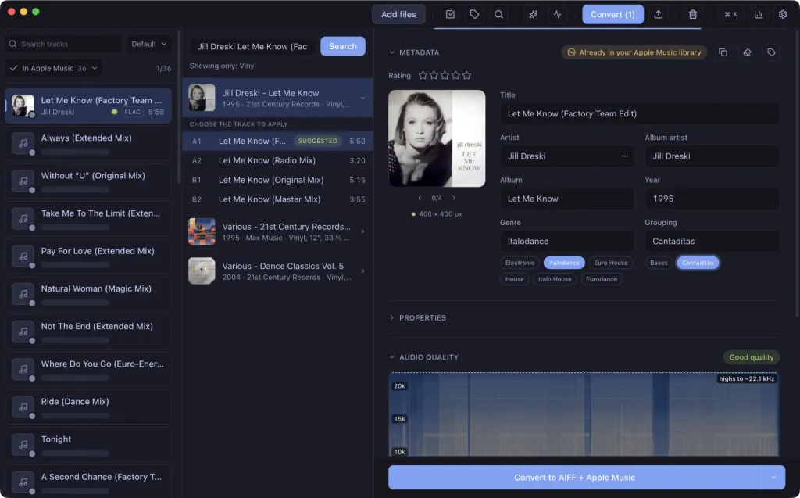

<p align="center">
  
</p>

<h1 align="center">Surco</h1>

<p align="center">
  Free, open-source track organizer for DJs — macOS &amp; Windows.
</p>

<p align="center">
  <a href="https://github.com/vigosan/surco-releases/releases/latest"></a>
  <a href="https://github.com/vigosan/surco-releases/releases"></a>
  <a href="LICENSE"></a>
</p>

Drop your tracks in. Surco finds the right metadata on Discogs and Bandcamp, checks that your files really are lossless, detects BPM and key, converts them, and hands everything to your DJ software or Apple Music.

<p align="center">
  
</p>

## What it does

- **Auto-tagging** — searches Discogs and Bandcamp and matches whole imports automatically: title, duration, artist and catalog number have to agree before anything is written, and uncertain matches are flagged for a one-click review instead of applied.
- **Fake-lossless detection** — a spectrogram plus an automatic verdict that flags a 320 kbps re-encode sold as FLAC/WAV, upsampled audio and other quality lies. No more squinting at spectra.
- **BPM & musical key** — detected locally, shown in Camelot or classic notation.
- **Conversion** — AIFF, MP3 (320/V0), WAV, FLAC and ALAC, with optional loudness normalization (integrated LUFS target + true-peak limiter) or peak normalization.
- **Plays well with your gear** — export to rekordbox, Traktor, Serato and Engine DJ; add straight to Apple Music; M3U8 playlists.
- **Built for batches** — duplicate detection, watched folders, multi-track editing, undo, keyboard-first navigation.

Everything runs on your machine: no account, no telemetry, free forever.

## Install

**[Download from getsurco.app](https://www.getsurco.app/en)** — notarized macOS builds (Apple Silicon &amp; Intel) and a Windows installer, with automatic updates.

macOS via Homebrew:

```bash
brew install --cask vigosan/surco/surco
```

All builds are published at [vigosan/surco-releases](https://github.com/vigosan/surco-releases/releases).

## Learn more

- [Guide](https://www.getsurco.app/en/guide) — every feature, with screenshots.
- [Changelog](https://www.getsurco.app/en/changelog) — what shipped in each release.
- También disponible en español: [getsurco.app](https://www.getsurco.app/).

## Develop

Monorepo with npm workspaces: `apps/desktop` (Electron + React + TypeScript) and `apps/web` (Vite + React + Tailwind).

```bash
npm install            # install all workspaces

npm run dev:desktop    # Electron app in development
npm run dev:web        # website in development
npm test               # desktop test suite
npm run build:desktop  # production build
npm run build:web      # website build
npm run dist:desktop   # package the installer
```

## Contributing

Issues and pull requests are welcome. Surco is GPL-3.0: improvements stay open for everyone.

## License

[GPL-3.0](LICENSE)
